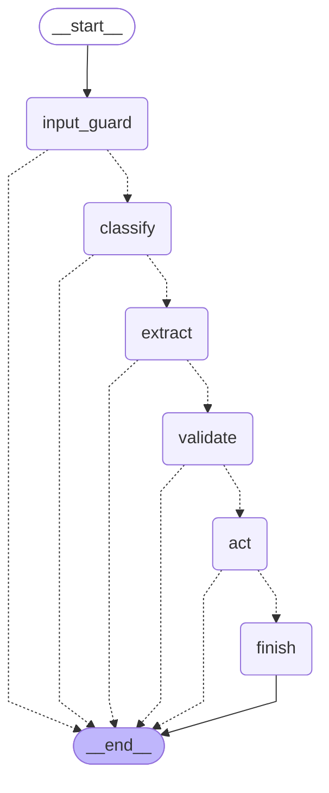

# Agent graph (LangGraph)

Each box is a step; dotted arrows are conditional (they can jump to the end early).

```mermaid
---
config:
  flowchart:
    curve: linear
---
graph TD;
	__start__([<p>__start__</p>]):::first
	input_guard(input_guard)
	classify(classify)
	extract(extract)
	validate(validate)
	act(act)
	finish(finish)
	__end__([<p>__end__</p>]):::last
	__start__ --> input_guard;
	act -.-> __end__;
	act -.-> finish;
	classify -.-> __end__;
	classify -.-> extract;
	extract -.-> __end__;
	extract -.-> validate;
	input_guard -.-> __end__;
	input_guard -.-> classify;
	validate -.-> __end__;
	validate -.-> act;
	finish --> __end__;
	classDef default fill:#f2f0ff,line-height:1.2
	classDef first fill-opacity:0
	classDef last fill:#bfb6fc
```
